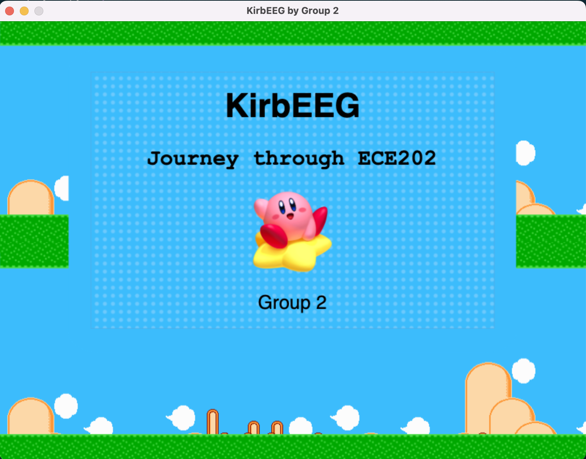
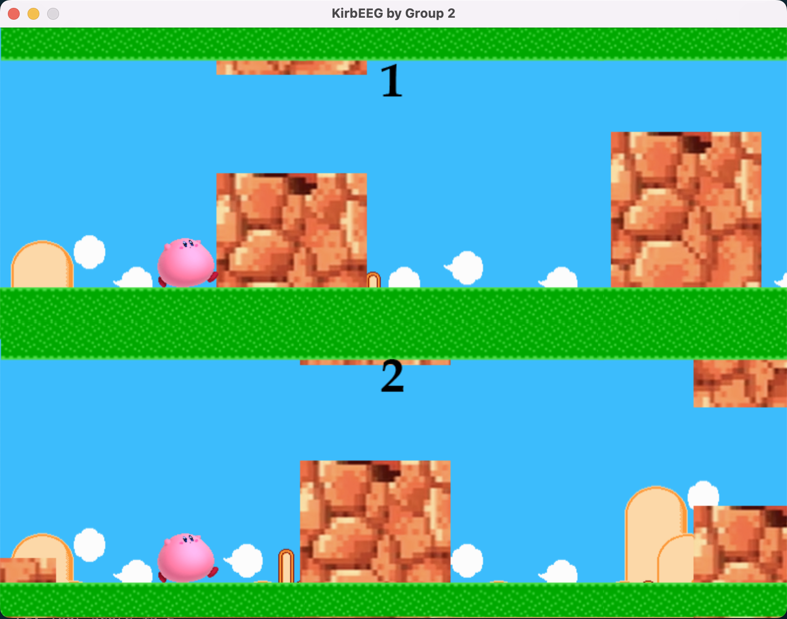

# KirbEEG

Content of this repository:
* `singleplayer.py` contains the code for running a single player KirbEEG game.
* `player2.py` contains the code for running 2-player KirbEEG game. 
* `gallery` folder contains sprites and audio sounds for the game. Sprites contain all images used to show the game, while sounds are used only when winning for now. 
* `players2` folder contains background used specifically for 2-player version.


## Quickstart

To run the game, download the entire folder. Be sure to have pygame installed in your computer, otherwise you can install it through:

```
pip install pygame
```

You can start the game running the command (2 players):

```
python player2.py
``` 

or (single player):

```
python singleplayer.py
```

You can control the game keyboards input. We use "space" and "up" for single player. For 2-player version, we use "a" to go up and "s" to go down for player 1, "b" to go up and "n" to go down for player 2, and "space" to start the game.

When started, the 2-player game should look like this:

<p align="center"></p>

<p align="center"></p>

## EEG-controlled game

To control the game through EEG you first need to connect board, electrodes and amplifiers. We run a 2 min calibration step in which we record for both players 2 minutes of data, 30 seconds with eyes open, 30s closed, 30s open, and 30s closed. This data needs to be stored and processed through the `Calibration.m` matlab code. This allows us to set the threshold that will be used to control the code. 

After the calibration process, thresholds will be saved in the `matlab` folder. You can use the TCP remote network functionality of Intan RHX software in order to stream collected data in real time to matlab. You can run `RealTime.m` matlab code to receive this data through TCP, process it and simulate keyboards inputs to control the KirbEEG game. **Be sure to select the correct channels in line of `RealTime.m`**.

```
% CHAN NAME SHOULD BE +1
chanName = [15 + 1, 18 + 1]
```

Once the windows open, you can select "wide" button and open the game. Remember to press "space" to make the game start. Your goal is to do more than 10 before the other player!
